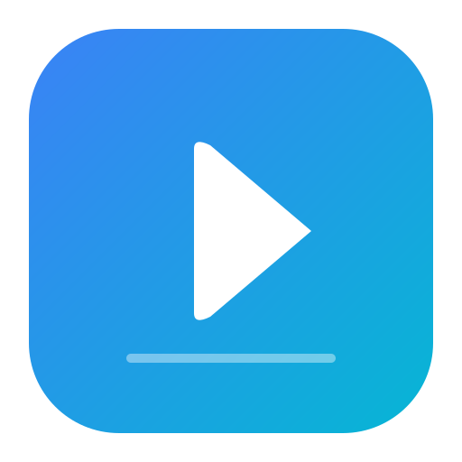
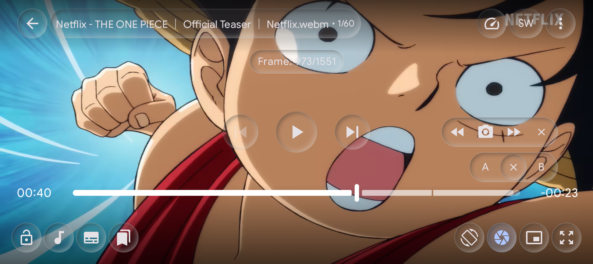
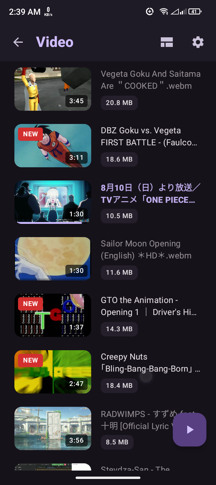
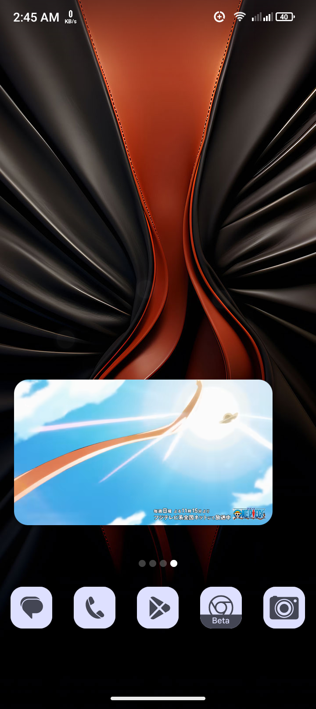
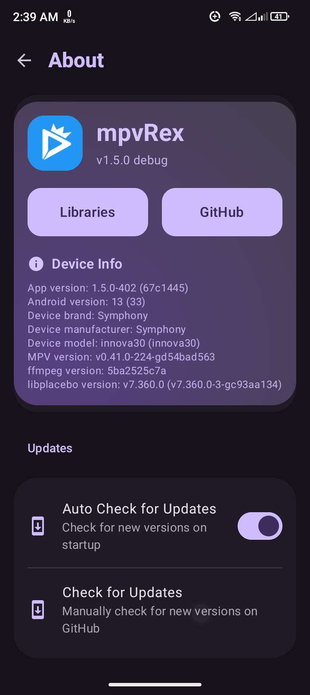
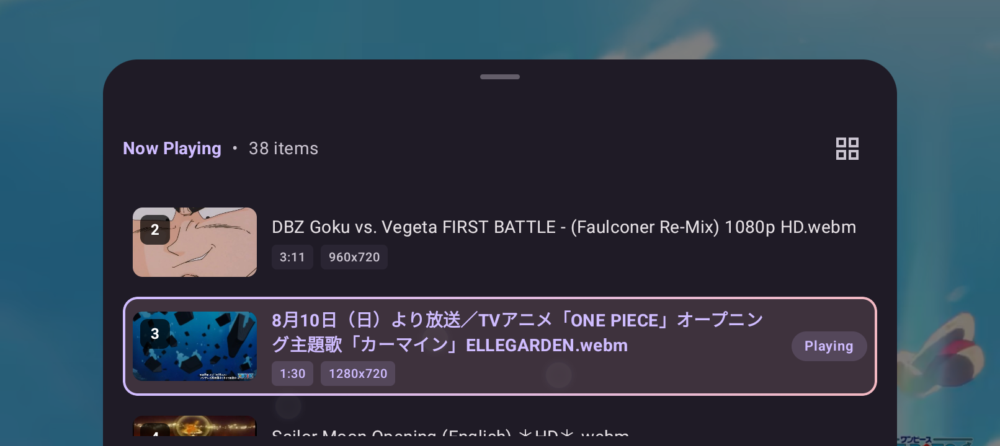
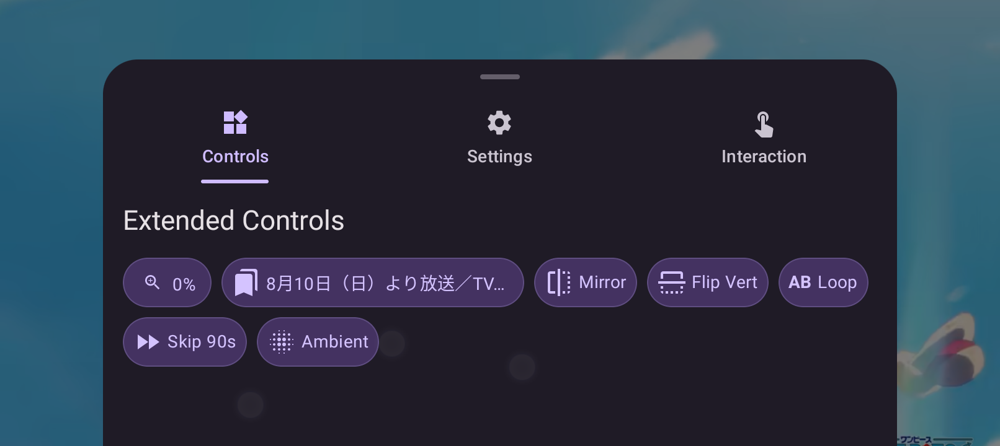

# REX Player

  

  <b>Feature-rich Android video player based on libmpv.</b>

  
  
  
  
  

> [!NOTE]
> **Repository moved**: from `sfsakhawat999/mpvRex` to [mpvRex/REX-Player](https://github.com/mpvRex/REX-Player). Old links will redirect automatically.

REX Player is an advanced, customizable video player for Android. It combines the versatility of libmpv with a modern Jetpack Compose interface and unique user-centric features.

---

## Showcase

  
  
<i>Player UI — Glassmorphism controls</i>

  
  
  

<i>Video browser · Picture-in-picture · About screen</i>

  
  

<i>Playlist window · File options sheet</i>

---

## Features

### 🎬 Playback & Gestures

- **Circular Double-Tap Seek** — fully customizable circular seek overlay with smooth transition animations
- **Seek Cancellation** — cancel a seek mid-gesture by dragging backwards, with interactive pointer-scaling feedback animations
- **Subtitle Drag-to-Reposition** — tap and drag subtitles vertically to position them anywhere on screen
- **Subtitle Swipe Seeking** — swipe horizontally to jump precisely between subtitle lines
- **Top Seek Capsule OSD** — pill-shaped overlay showing double-tap seek feedback without blocking the video
- **Dynamic A-B Loop & Frame Navigation** — set loop points with adjustable vertical bias; fine-tune with a floating, non-colliding frame-by-frame panel
- **Advanced Zoom & Pan** — independent video scaling, black bar removal, and interactive zoom/pan sliders in the Aspect Ratio sheet; settings saved per video
- **Refined Tap & Lock Logic** — custom exclusion zones, optional seekbar tap prevention, and one-tap control lock

### 🎨 UI & Aesthetics

- **Glass Theme Player UI** — sleek glassmorphism design across controls, seekbar, title bar, speed indicator, and Shorts player
- **Dynamic Tab Manager** — hide, show, and reorder dashboard tabs to fully customize your bottom navigation
- **Material You** — player controls dynamically match your Android system accent or app theme
- **Theme Transition Animation** — premium circular reveal animation when toggling between light and dark themes
- **Embedded Cover Art Thumbnails** — automatic extraction of embedded cover art and sibling artwork as local video thumbnails

### 🗂️ File Explorer & Media Library

- **Unified Explorer Engine** — ensures every browsing mode (local storage, network shares, and playlists) looks, feels, and behaves identically
- **M3U Playlist Support** — load M3U playlists with custom stream titles and drag-and-drop reordering
- **Multi-Select Range** — select a range of items easily by long-pressing the first file and tapping the last
- **Sectioned Grid/List Layouts** — independently customizable inside tree subdirectories
- **Folder Metadata** — recursive file counts, watched/unplayed dimming, and reactive "NEW" badges
- **Breadcrumb Navigation** — toggleable path breadcrumbs in the tree view
- **Advanced Sorting** — by Name, Date, Size, and Duration
- **Network Streaming Proxy** — high-performance proxy for WebDAV, SMB, and FTP streams with image preview caching
- **Mark As System** — mark videos as watched, skipped, new, or flagged; filter your library accordingly
- **Media Library View** — browse your full video collection outside the file tree
- **Shorts Mode** — overhauled vertical video player with directory source filters, session Free Mode, Clean UI Mode, and reactive MPV observers

### ⚙️ Engine & Customization

- **HDR-to-SDR Tone Mapping** — high-quality tone mapping via `hdr-toys` shader pipeline
- **Smart Orientation** — force landscape/portrait per video, stored as a preference
- **Audio Support** — scan, display, and play standalone audio files directly inside the file explorer and player

### ⚡ Performance

- **Battery-Optimized Playback** — optimized playback engine designed to maximize battery life during long viewing sessions
- **Reactive StateFlow Observers** — per-instance MPV property observers that survive background resume and eliminate frozen UI
- **Gesture JNI Elimination** — removed per-event JNI reads during pan and zoom gestures for smoother interaction
- **Smart Background Service** — background playback service starts only when actually backgrounded

---

## Installation

  
  

<i>Preview builds may be unstable and are intended for testing only.</i>

---

## Translations

Translations can be managed using **[Droidlate](https://github.com/estiaksoyeb/Droidlate)** ([PyPI](https://pypi.org/project/droidlate/)) — a local, web-based UI designed for editing Android `strings.xml` translation files.

If you would like to contribute to translating REX Player into your language, please refer to the [Translation Contribution Guide](CONTRIBUTING.md#translation-contributions) for step-by-step instructions on running Droidlate locally.

---

## Credits

REX Player has its roots in **[mpvEx](https://github.com/marlboro-advance/mpvEx)**, which itself builds on **[mpv-android](https://github.com/mpv-android/mpv-android)**. We're grateful for the foundation they laid.

Additional inspiration and reference:
[mpvKt](https://github.com/abdallahmehiz/mpvKt) · [Next Player](https://github.com/anilbeesetti/nextplayer) · [Gramophone](https://github.com/FoedusProgramme/Gramophone)

---

## License

Distributed under the **Apache License 2.0**. See `LICENSE` for details.
