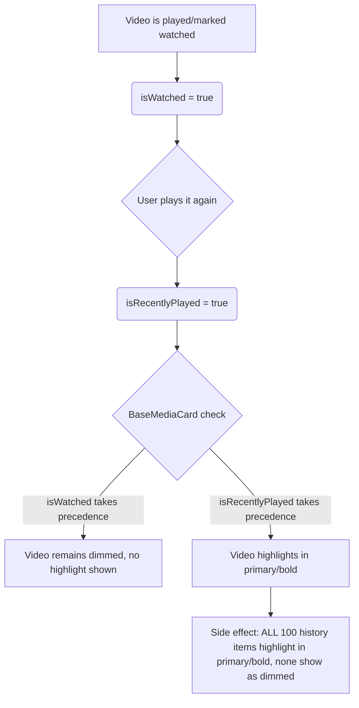

# mpvRex 媒体状态与视觉样式架构

本文档完整梳理了 **mpvRex** 文件浏览器中媒体条目的状态全貌。它说明了这些状态如何存储、计算与可视化，诊断了近期 Bug 的成因，并定义了健壮、永久的解决方案。

---

## 1. 核心数据库实体

媒体状态由文件元数据与两个 Room 数据库实体组合推导而来：

### A. `PlaybackStateEntity`
记录单个文件的播放进度与播放参数。以文件的显示名（`mediaTitle`）作为主键。
* **`lastPosition`（Int）：** 播放偏移量，单位秒。
* **`timeRemaining`（Int）：** 剩余时长，单位秒（`duration - lastPosition`）。
  * *哨兵值：* `-1` 表示该文件被手动标记为"新片"。
* **`hasBeenWatched`（Boolean）：** 持久化标志，表示视频是否曾越过"已看完"阈值，或被手动标记为"已看完"。

### B. `RecentlyPlayedEntity`
记录已播放媒体条目的时间顺序历史。
* **`filePath`（String）：** 文件绝对路径。
* **`timestamp`（Long）：** 播放时间。
* **`launchSource`（String）：** 记录视频是如何被打开的。
  * *哨兵值：* `"mark_as"` 表示该条目被手动标记为已看完（或其他不应高亮的状态）。
  * *哨兵值：* `"mark_as_last_played"` 表示该条目被手动标记为最后播放（启用高亮）。

---

## 2. 媒体状态矩阵

以下是每种媒体状态的定义、判定与可视化方式：

| 状态 | 定义与理由 | 判定逻辑 | UI 呈现 |
| :--- | :--- | :--- | :--- |
| **新片（New）** | 新近添加且从未播放的视频，或手动标记为"新片"以提醒用户观看。 | `state.timeRemaining == -1` <br>或<br>（无播放状态 且 `videoAge <= unplayedOldVideoDays` 阈值） | 在卡片上渲染红色 **`NEW`** 徽章覆盖层。 |
| **从未播放（Never Played）** | 视频没有任何播放进度。理由：用于决定是否显示/隐藏进度条。 | `videoFilesWithPlayback[videoId] == null`（即进度不在 `0.01..0.99` 范围内）。 | 卡片上不显示进度条。 |
| **已看完（Watched）** | 视频已播完。理由：通过变暗帮助用户识别已看过的文件。 | `state.hasBeenWatched == true` <br>或<br>进度百分比 $\ge$ `watchedThreshold`（如 90%）。 | 标题文字变暗（`onSurface` 60% 不透明度）。 |
| **最后播放（Last Played）** | 最近播放/标记的单个视频或一批视频（全局或当前文件夹内）。理由：作为自动滚动与主焦点的目标。 | `video.path in lastPlayedVideoPathsInFolder` | 标题文字以**主色**高亮，并采用**粗黑**样式。 |
| **最近播放（Recently Played）** | （已弃用，不再用于 UI 高亮）此前用于高亮包含历史文件的文件夹。现在文件夹仅在其包含当前活动的"最后播放"文件时才高亮。 | 无 | 文件夹与视频均不再使用该状态进行高亮，以避免杂乱。 |

---

## 3. 高亮冲突的根本原因

代码库在渲染视频时，将**最近播放**（最近 100 条历史条目列表）与**最后播放**（当前唯一活动文件）混为一谈。

### 冲突如何显现：



1. **如果 `isWatched` 在 `BaseMediaCard` 中优先：**
   当你再次播放一个已看完的视频时，它会被加入历史。于是 `isWatched = true` 与 `isRecentlyPlayed = true` 同时成立。由于 `isWatched` 优先，视频保持变暗，不会高亮。
2. **如果 `isRecentlyPlayed` 在 `BaseMediaCard` 中优先：**
   当你再次播放已看完的视频时，它能正确高亮。然而，由于文件浏览器检查的是 `recentlyPlayedPaths.contains(video.path)`（最多 100 个文件的列表）而非仅单个最后播放的路径，**历史列表中的每一个已看完视频都会被标记为 `isRecentlyPlayed = true`**。因为 `isRecentlyPlayed` 现在优先，*它们全部*会以粗体/主色点亮，彻底破坏了整条历史列表的变暗"已看完"样式。

---

## 4. 已实施的解决方案

为永久修复此问题，我们将文件夹历史高亮与视频文件高亮解耦。

### 规则 1：视频仅为*当前活动的最后播放*文件高亮（全局或按文件夹）
视频卡片若属于**当前活动的最后播放集合**（`lastPlayedVideoPathsInFolder`），则标记为 `isRecentlyPlayed = true`。该集合包含全局唯一最后播放的视频，或用户最近一批手动标记为最后播放的全部视频。若文件夹中没有任何活动的条目，则回退到该文件夹中最新的单条历史记录。
* **原因：** 这确保文件夹能显示用户离开的位置（若没有活动的条目，则有且仅有一个回退高亮），同时允许多个条目并发标记为最后播放（它们会全部全局高亮，并点亮其所在文件夹树）。

### 规则 2：文件夹仅为其下包含活动的最后播放文件的父级高亮
与视频类似，文件夹仅在其为任一活动全局最后播放路径（`recentlyPlayedFilePaths`）的父级（或在目录树路径上）时，才标记为 `isRecentlyPlayed = true`。
* **原因：** 这确保只有包含当前活动最后播放条目的文件夹会高亮，避免为旧历史高亮文件夹。

### 规则 3：`BaseMediaCard` 中的视觉样式优先级
视觉优先级通过自定义的 `shouldHighlight = isRecentlyPlayed && !(isWatched && isNeverPlayed)` 判定解决。
1. `shouldHighlight` $\rightarrow$ 高亮（主色、粗体）。
2. `isWatched` $\rightarrow$ 变暗（60% 不透明度、常规字重）。
3. 其它 $\rightarrow$ 默认样式。

* **标记为已完成工作流：** 当视频被标记为已完成时，它变为已看完（`isWatched = true`）且进度被清除（`isNeverPlayed = true`），这强制 `shouldHighlight` 为 `false`，因此即使它是最后播放的条目也会立即变暗。
* **重看工作流：** 当之前已看完的视频被再次播放时，它获得活动进度（`isNeverPlayed = false`），这使 `shouldHighlight` 为 `true`，并作为活动的最后播放文件高亮。

---

## 5. 具体实施细节

### A. [BaseMediaCard.kt](file:///root/Projects/mpvRex/app/src/main/kotlin/xyz/mpv/rex/ui/browser/cards/BaseMediaCard.kt)
确保 `shouldHighlight` 在网格与列表两种卡片布局变体中都被判定：
```kotlin
val shouldHighlight = isRecentlyPlayed && !(isWatched && isNeverPlayed)
color = when {
    shouldHighlight -> MaterialTheme.colorScheme.primary.copy(alpha = 0.9f)
    isWatched -> MaterialTheme.colorScheme.onSurface.copy(alpha = 0.6f)
    else -> MaterialTheme.colorScheme.onSurface
}
fontWeight = if (shouldHighlight) FontWeight.Black else FontWeight.Normal
```

### B. [FileSystemBrowserScreen.kt](file:///root/Projects/mpvRex/app/src/main/kotlin/xyz/mpv/rex/ui/browser/filesystem/FileSystemBrowserScreen.kt)
更新了 `FileSystemSearchContent` 内的视频条目，使其在搜索结果集合内计算 `lastPlayedVideoPathsInFolder` 并高亮它们：
```kotlin
val lastPlayedVideoPathsInFolder = remember(searchResults, recentlyPlayedPaths, recentlyPlayedFilePaths) {
  val pathsInSearch = searchResults.filterIsInstance<FileSystemItem.VideoFile>().map { it.video.path }.toSet()
  val overallLastPlayed = pathsInSearch.filter { it in recentlyPlayedFilePaths }.toSet()
  if (overallLastPlayed.isNotEmpty()) {
    overallLastPlayed
  } else {
    val fallbackPath = recentlyPlayedPaths.firstOrNull { it in pathsInSearch }
    if (fallbackPath != null) setOf(fallbackPath) else emptySet()
  }
}
// For video cards in search:
isRecentlyPlayed = videoFile.video.path in lastPlayedVideoPathsInFolder
```
对于文件夹，更新了 `FolderCard` 的 `isRecentlyPlayed`，检查文件夹路径是否为 `recentlyPlayedFilePaths` 中任一活动全局最后播放路径的父级。

### C. [UnifiedExplorerContent.kt](file:///root/Projects/mpvRex/app/src/main/kotlin/xyz/mpv/rex/ui/browser/components/UnifiedExplorerContent.kt)
引入了 `LocalLastPlayedVideoPathsInFolder` 与 `LocalRecentlyPlayedFilePaths` 两个 CompositionLocal，用于将文件夹的最后播放条目与活动全局最后播放路径干净地传递给卡片渲染。
渲染块根部：
```kotlin
val lastPlayedVideoPathsInFolder = remember(items, recentlyPlayedPaths, recentlyPlayedFilePaths) {
  val pathsInItems = items.mapNotNull { item ->
    when (item) {
      is Video -> item.path
      is VideoWithPlaybackInfo -> item.video.path
      is RecentlyPlayedItem.VideoItem -> item.video.path
      is FileSystemItem.VideoFile -> item.video.path
      is PlaylistVideoItem -> item.video.path
      else -> null
    }
  }.toSet()
  val overallLastPlayed = pathsInItems.filter { it in recentlyPlayedFilePaths }.toSet()
  if (overallLastPlayed.isNotEmpty()) {
    overallLastPlayed
  } else {
    val fallbackPath = recentlyPlayedPaths.firstOrNull { it in pathsInItems }
    if (fallbackPath != null) setOf(fallbackPath) else emptySet()
  }
}
```
在 `ExplorerItemCard` 子组合内部，通过 `LocalLastPlayedVideoPathsInFolder.current` 获取并对所有视频类型使用：
```kotlin
val isRecentlyPlayed = item.path in lastPlayedVideoPathsInFolder // (or item.video.path in lastPlayedVideoPathsInFolder)
```
对于文件夹，更新了 `FolderCard` 的 `isRecentlyPlayed`，检查文件夹是否为 `LocalRecentlyPlayedFilePaths.current` 中任一路径的父级。

### D. [RecentlyPlayedOps.kt](file:///root/Projects/mpvRex/app/src/main/kotlin/xyz/mpv/rex/utils/history/RecentlyPlayedOps.kt)
引入了 `observeLastPlayedPathsForHighlight()` 流，用于返回单个最后播放条目，或一批被标记为最后播放的条目：
```kotlin
fun observeLastPlayedPathsForHighlight(): Flow<Set<String>> {
  return repository.observeRecentlyPlayed(50).map { list ->
    val filteredList = list.filter { 
      !(it.filePath.endsWith(".m3u") || it.filePath.endsWith(".m3u8"))
    }
    val newestHighlight = filteredList.firstOrNull { it.launchSource != "mark_as" } ?: return@map emptySet()
    
    if (newestHighlight.launchSource == "mark_as_last_played") {
      val newestTimestamp = newestHighlight.timestamp
      filteredList.filter { 
        it.launchSource == "mark_as_last_played" && 
        kotlin.math.abs(it.timestamp - newestTimestamp) <= 5000 
      }.map { it.filePath }.toSet()
    } else {
      setOf(newestHighlight.filePath)
    }
  }
}
```

### E. [BaseBrowserViewModel.kt](file:///root/Projects/mpvRex/app/src/main/kotlin/xyz/mpv/rex/ui/browser/base/BaseBrowserViewModel.kt)
将 `recentlyPlayedFilePaths` 暴露为可观察的 `StateFlow<Set<String>>`，供所有派生 ViewModel（包括 `FolderListViewModel`、`VideoListViewModel` 与 `MediaLibraryViewModel`）使用：
```kotlin
val recentlyPlayedFilePaths: StateFlow<Set<String>> =
  RecentlyPlayedOps
    .observeLastPlayedPathsForHighlight()
    .stateIn(viewModelScope, SharingStarted.WhileSubscribed(5000), emptySet())
```

### F. 屏幕集成（[VideoListScreen.kt](file:///root/Projects/mpvRex/app/src/main/kotlin/xyz/mpv/rex/ui/browser/videolist/VideoListScreen.kt)、[FolderListScreen.kt](file:///root/Projects/mpvRex/app/src/main/kotlin/xyz/mpv/rex/ui/browser/folderlist/FolderListScreen.kt)、[MediaLibraryContent.kt](file:///root/Projects/mpvRex/app/src/main/kotlin/xyz/mpv/rex/ui/browser/medialibrary/MediaLibraryContent.kt)）
更新了各 Composable 屏幕与子内容，观察 `recentlyPlayedFilePaths` 并将其传给 `UnifiedExplorerContent`：
* 通过 `val recentlyPlayedFilePaths by viewModel.recentlyPlayedFilePaths.collectAsState()` 收集
* 以参数 `recentlyPlayedFilePaths = recentlyPlayedFilePaths` 传递给对应的列表容器。

### G. [RecentlyPlayedDao.kt](file:///root/Projects/mpvRex/app/src/main/kotlin/xyz/mpv/rex/database/dao/RecentlyPlayedDao.kt)
更新了 `getLastPlayedForHighlight()` 与 `observeLastPlayedForHighlight()` 查询，在放行的 `launchSource` 数据库检查中加入 `'mark_as_last_played'`，使手动标记的条目能成功注册为全局最后播放目标。

### H. [HistoryManager.kt](file:///root/Projects/mpvRex/app/src/main/kotlin/xyz/mpv/rex/utils/history/HistoryManager.kt)
更新了 `MarkAsState.LastPlayed` 处理器，向历史写入 `launchSource = "mark_as_last_played"` 而非 `"mark_as"`，使其能绕过"已看完"状态的变暗规则并触发活动高亮状态。